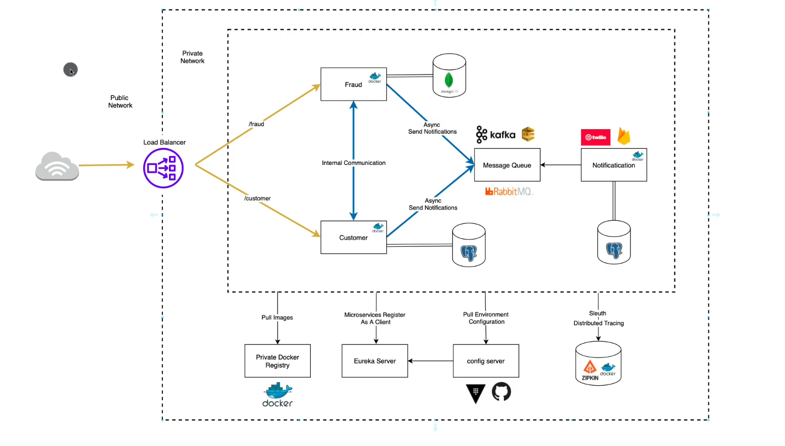

# Spring-MicroServices
### Microservices and Distributed Systems

# Prerequisites

In order to run the application, you need to have:
1. JDK 17 (https://www.oracle.com/java/technologies/downloads/)
2. Maven 3.8.6 (https://maven.apache.org/download.cgi).
3. Git (https://git-scm.com/downloads)
   You also need to configurate your user and system path variables for both java and maven. You also need to have git installed in order to clone the project .
4. Minikube 1.29.0
5. kubectl 1.26.2

### Run it locally
1. Open terminal and clone the repo:
```shell
git clone https://github.com/IGDERZEN-Zakaria/Spring-MicroServices.git
```

2. Make sure you are in project directory  in order to build and package the application with the following Cmd Commande:
```shell
mvn clean install
```

3. launch the docker compose containers 
```shell
docker compose up -d
```
4. launch the microservices applications in this order 

- eureka-server
- apigw
- customer
- fraud
- notification

```shell
java -jar eureka-server/target/eureka-server-1.0-SNAPSHOT.jar 
java -jar apigw/target/apigw-1.0-SNAPSHOT.jar 
java -jar customer/target/customer-1.0-SNAPSHOT.jar
java -jar fraud/target/fraud-1.0-SNAPSHOT.jar
java -jar notification/target/notification-1.0-SNAPSHOT.jar
```

## Data Base

This application has postgreSQL database , via docker container
You can access it by browsing : http://localhost:5050/browser

Password = password

## Eureka Server

You can access it by browsing : http://localhost:8761

## Zipkin


You can access it by browsing : http://localhost:9411

## RabbitMQ

You can access it by browsing : http://localhost:15672

UserName = guest

Password = guest


## Docker Compose

### use jib plugin to push images to dockerHub
```shell
mvn clean package -P build-docker-image 
-Djib.from.auth.username=Username 
-Djib.from.auth.password=Password 
-Djib.to.auth.username=Username 
-Djib.to.auth.password=Password          
```
### pull docker images from dockerHub
```shell
docker compose pull
```

### launch the containers
```shell
docker compose up -d
```
### check logs of a given container
```shell
docker logs container_name
```
### stop all containers
```shell
docker compose stop
```

## Kubernetes

### start minikube (Minikube is used to run Kube clusters loccaly)
```shell
minikube start
```

### check minikube status
```shell
minikube status
```

### check minikube ip address
```shell
minikube ip
```
### runing kubernetes/hello-world
```shell
docker run --rm -p 80:80 amigoscode/kubernetes:hello-world
```
### runing kubernetes/hello-world pod with kubectl
```shell
sudo kubectl run hello-world --image=amigoscode/kubernetes:hello-world --port=80
```
### to display pods
```shell
kubectl get pods
```
### to delete a pod
```shell
kubectl delete pod pod_name
```


Interaction between our machine and our kube is done by KubeCTL ( commande line tool)
KubeCtl is also used to :
- deploy applications
- Inspect
- Edit ressources
- Debug clusters
- View logs
- ...


# Architecture



# Troubleshooting (Ubuntu)

### before lunching local postgresQl DB 
```shell
sudo systemctl start postgresql
```
###  before lunching docker postgresQl container 
```shell
sudo systemctl stop postgresql
sudo lsof -i :5050
sudo kill -9 "pid"
```

### to change default java version 
```shell
sudo update-alternatives --config java
```

### delete minikube cluster
```shell
minikube delete --all
```

### start minikube cluster with 4G of memory
```shell
minikube start --memory=4g
```
### stop apache2 service in localhost
```shell
sudo systemctl stop apache2
```

### set port for kubectl 
in cas you get the error :
dial tcp 127.0.0.1:8080: connect: connection refused
```shell
kubectl proxy --port=8080
```


